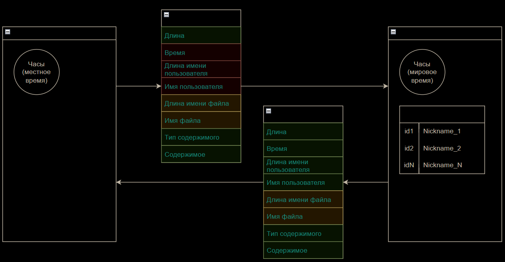

# Консольный TCP-чат с возможностью передачи файлов

## Установка и использование

TODO

## Описание протокола

Общий вид организации обмена данными приведен ниже:

Здесь **красные** поля - не используемые приемной стороной, **зеленые** - используемые, **желтые** - используемые при необходимости (в зависимости от флага типа сообщения).

Пакет содержит следующие поля:

* **Длина** - фиксированное по размеру поле для хранения длины передаваемого сообщения (без учета поля длины)
* **Время** - время отправки сообщения
* **Длина имени пользователя** - поле фиксированной размерности для хранения длины (в символах) имени пользователя
* **Имя пользователя** - имя пользователя в кодировке Unicode
* **Длина имени файла** - поле фиксированной размерности для хранения длины (в символах) имени передаваемого файла
* **Тип содержимого** - поле с флагом типа содержимого (MSG_TEXT, MSG_FILE)
* **Содержимое** - поле переменной длины для отправки пользовательского контента

### Детали реализации обмена сообщениями:

* Клиент формирует сообщение для сервера и пакует его:
  * Сообщение текстовое?
    * Формируется содержимое,
    * указывается тип содержимого,
    * вычисляется общая длина пакета.
  * Сообщение файловое?
    * Формируется содержимое,
    * указывается тип содержимого,
    * добавляется имя файла,
    * записывается фактическая длина имени файла *(длина используемого пространства в поле протокола)*,
    * вычисляется общая длина пакета.
* Сообщение преобразуется в упорядоченный байтовый массив и отправляется на сервер;
* Сервер принимает сообщение и отображает содержимое:
  * Если это текст:
    * Имя отправителя (из таблицы соответствия по id клиента),
    * время приема (сервером),
    * текст сообщения.
  * Если это файл:
    * Имя отправителя (из таблицы соответствия по id клиента),
    * время приема (сервером),
    * информация об отправленном файле (имя).
* Сервер запаковывает содержимое принятого сообщения в новый пакет, *заменяя* при этом поля:
  * Длина имени пользователя;
  * Имя пользователя;
  * Время (глобальное время на сервере на момент обработки сообщения);
  * Остальные поля остаются AS IS, как их прислал пользователь.
* Сервер отправляет пакет всем подписчикам, кроме отправителя.
* Пользователи получают сообщение и отображают его в соответствии со своей логикой:
  * Отображаются имя отправителя и время отправки (с поправкой на местное время);
  * При необходимости указывается имя принятого файла;
  * Также в зависимости от флага содержимого может отображаться текстовое сообщение для пользователя.

Это общая схема работы протокола. Функции формирования пакетов данных инкапсулирует в себе класс Message. В нем, соответственно, содержатся также и размерности полей протокола, а также иные необходимые для реализации константы.
